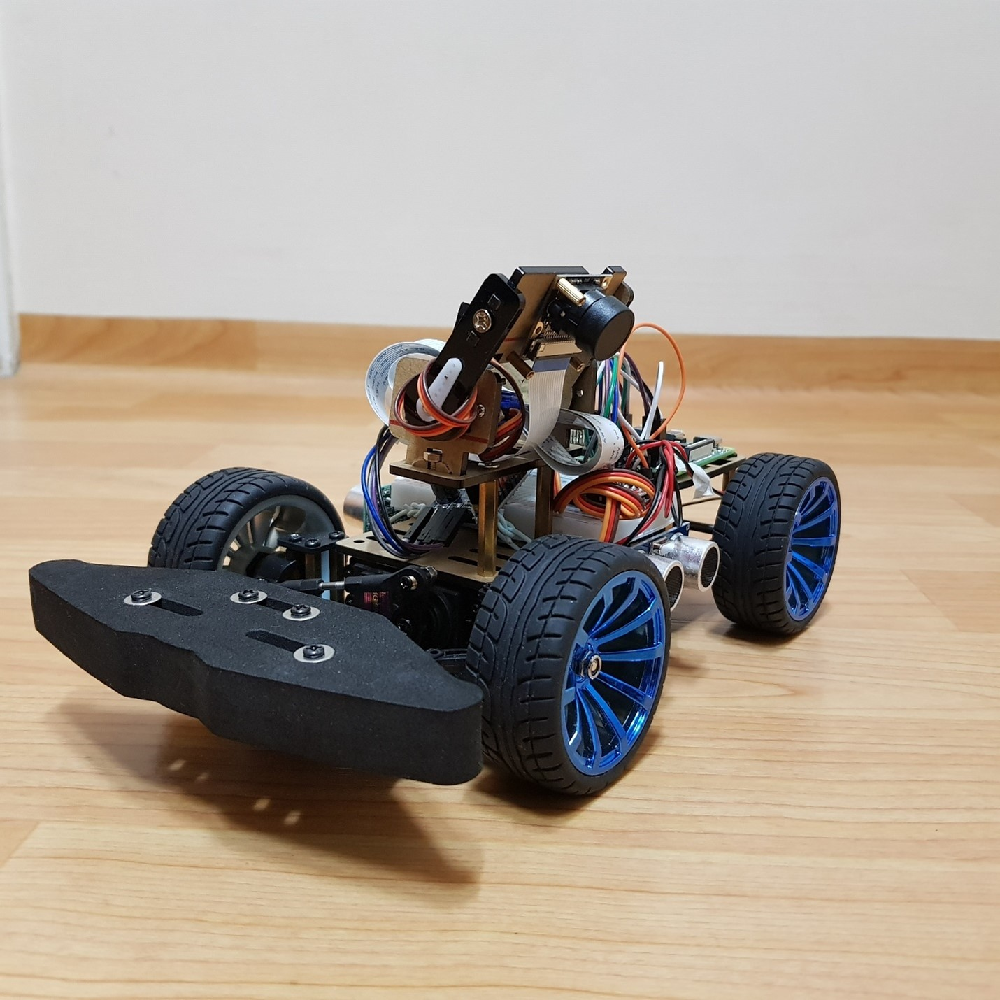
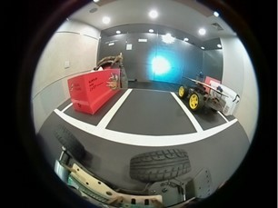
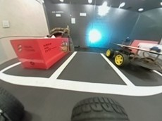
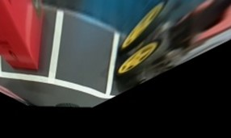
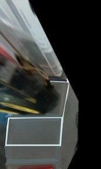
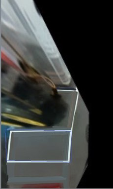
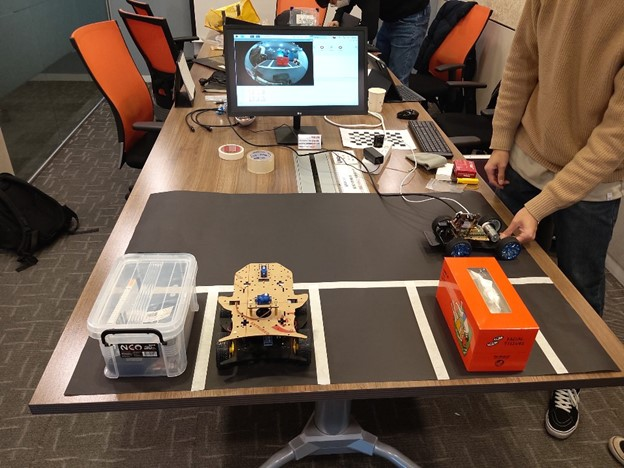

# AutoParking

AutoParking using RaspberryPi

## Overview

This project has been performed under three objectives.

1) Study and analyze the latest autonomous parking algorithms for application

2) Implement and simulate autonomous parking

3) Conceptualize business idea of autonomous charging service including a mobile application and a battery charger robot manipulator. The service is to enable self-driving cars charge their batteries instead of letting cars merely idle at parking lots.


For detailed information about the project, please check the [report](./Report.pdf) attached to this repository.


## Implementation on RaspberryPi4b

### Hardware Development

- One vehicle chasis with a suspension structure
- Two RPi fisheye camera lens modules
- Arducam Multi Camera Adapter Doubleplexer Stereo mdule
- PCA9685 PWM/Servo driver
- MG996R Servo motor
- TB6612 DC/Stepper motor
- 12V DC motor
- TOF ultrasonic sensor




### Bird View Image

 The fisheye image needs to be converted into undistorted image and then the birdview image. Below pictures show the three stages of image transformation.

<table>
    <tr><td> </td>
    <td> </td>
        <td> </td>
    </tr>
    <tr align="center">
    <td>Fisheye Image</td>
    <td>Undistorted Image</td>
    <td>BirdView Image</td>
    </tr>
</table>


### Parking Lot Detection

 Parking Lot Detection model is based on [context-based parking slot detection](https://github.com/dohoseok/context-based-parking-slot-detect). 

### Results

 After obtaining the bird view image from our test environment, the vacant parking slot could be detected with the context-based recognizer model.

<table>
      <tr align="center"><td> </td>
    <td> </td>
    </tr>
    <tr align="center">
    <td>Test Image</td>
    <td>Test Result Image</td>
    </tr>
</table>


### Test Environment

  For validation of our model, we constructed our own envrionment. We tried to reconstruct test environment as close as the real-world parking lot. 





### Execution

You can just simply start the RaspberryPi car to park autonomously with this script.

Still you need to have a context-based parking slot detector model which can be downloade from [here](https://github.com/dohoseok/context-based-parking-slot-detect)

Save the weights under **./ScatCar/models/context_based/weight_pcr** and **./ScatCar/models/context_based/weight_psd**


```
python main.py
```


## Authors

[brucekimork](https://github.com/brucekimrok)

[hkh9715](https://github.com/hkh9715)

[Hoyongpark](https://github.com/Hoyongpark)

[kkaki19](https://github.com/kkaki19)

[limaries30](https://github.com/limaries30)


## References

**Around View Monitoring (AVM)**

https://github.com/Nebula4869/fisheye_camera_undistortion

https://github.com/Ahid-Naif/Around-View-Monitoring-AVM

**Context-Based Parking Slot Detection**

https://github.com/dohoseok/context-based-parking-slot-detect


